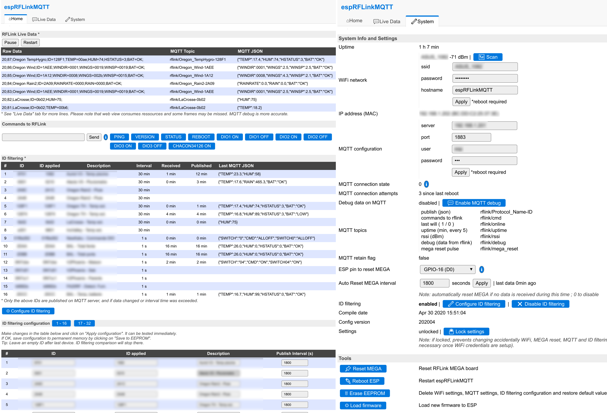

# espRFLinkMQTT

espRFLinkMQTT acts as a gateway between a [RFLink](http://rflink.nl) board and a MQTT server. It works on ESP8266: ESP01, D1 mini, NodeMCU, RFLink WiFi board, ...

It includes the following main functions:

- Receive data from RFLink board and forward to MQTT server in JSON format
- Receive commands from MQTT server and forward to RFLink board
- Perform conversions so that data on MQTT server can be used directly (hexadecimal to decimal for example)
- See data directly in web interface, send commands, change settings
- Configure which IDs should be filtered and sent to MQTT server
- Define an ESP pin to reset RFLink Mega board (with auto-reset option) 



## Setup:

RFLink-Hardware is required, official or DIY. For software, there are two options :

### 1. Use already compiled firmware

- Download firmware (.bin file)
- Upload firmware to ESP and reset
- Wait for 1 minute
- Connect to Wifi network espRFLinkMQTT
- Open http://192.168.4.1/ in your browser
- Click on System tab
- Fill WiFi network credentials and click on Apply
- Optional : fill MQTT configuration and click on Apply
- Click on Reboot ESP
- Connect to the configured WiFi network
- Use web interface by pointing your browser to ESP IP
 
### 2. Compile your own firmware

- Edit options in config.h
	- Serial and hardware configuration
	- Wi-Fi and MQTT settings
	- Update USER_IDs table with your own devices if you want to use ID filtering (this can be modified later as well)
	- Modify USER_CMDs table to show you own commands on the web interface
- Compile with Arduino IDE or PlatformIO (both work) - library PubSubClient is required
- Upload to ESP
- Use web interface by pointing your http browser to ESP IP

### Hardware setup

- **Wire ESP RX pin to RFLink MEGA TX pin, and ESP TX pin to RFLINK MEGA RX pin**
	- In theory, it is required to use a voltage divider or level logic shifting as MEGA is 5V and ESP 3.3V 
	- Another pin can be used if using your own compiled firmware, see config.h for explanations
- To handle hardware reset of RFLink MEGA from ESP, wire ESP GPIO pin to RFLink MEGA RST (configuration can be done config.h or from web interface)

## How to use

### Data from RFLink

When RFLink receives something this is presented on the serial line eg.:

```
20;2A;Xiron;ID=2801;TEMP=0043;HUM=29;BAT=OK;
```

espRFLink will convert this information and publish it on topic:

```
rflink/Xiron-2801
```
as JSON:
```
{TEMP:"6.7",HUM:"29",BAT:"OK"};
```

### Send command with MQTT

Publish the command according to [RFLink documentation](http://www.rflink.nl/blog2/protref) to the topic:

```
rflink/cmd
```

e.g.
```
10;NewKaku;01dd77d5;1;OFF;
```
### Send command from web interface

On the web interface main page, use the form  or a predefined command button

# Watchout, sources, changes

Use this software at your own risk.

Parts of the code were first inspired from [rflink-to-mqtt](https://github.com/Phileep/rflink-to-mqtt), [RflinkToJsonMqtt](https://github.com/jit06/RflinkToJsonMqtt) and [RFLink-to-FHEM-via-MQTT](https://github.com/lubeda/RFLink-to-FHEM-via-MQTT/)

The following capabilities were added:
- MQTT username, password and will topic
- Adds a new unique field if a CMD field follows a SWITCH field (ex: "SWITCH02" = "ON" added to "SWITCH"="02", CMD="ON")
- Hardware reset RFLink MEGA with ESP pin
- Auto reset RFLink MEGA if no data is received within a specific time frame (disabled by default) 
- HTTP server to show data received and how it is converted, with javascript functions to filter or sort colum by clicking on headers (Live data tab only)
- Debug mode to publish on MQTT server with possibility to enable/disable
- Uptime published on MQTT server every 5 minutes
- OTA firmware update from web interface
- Send commands from web interface with possibility to setup a predefined user list
- Change easily serial interface to be used : hardware serial RX/TX, software serial on user defined pins, or a mix ; by default it listens to RFLink MEGA on ESP RX pin and writes to RFLink MEGA on ESP TX
- Handles negative values for fields TMP, WINCHL, WINTMP
- Check data received is ASCII
- ID filtering: option to publish only a list of filtered IDs to MQTT server. In addition, possibility to publish only on data change but still to publish after a user defined time interval (disabled by default)
- Show setup information on web interface plus last received / published time for each defined filtered ID
- Use of [ESP Easy](https://github.com/letscontrolit/ESPEasy) CSS for nice web interface
- Memory use optimization
- Possibility to update MQTT settings (server, port, user, pass) from web interface
- Non blocking loop when MQTT connection fails. Messages from RFLink are handled in the web interface even if MQTT server is not connected (not recommended as web interface may hang slightly on reconnection)
- Retain flag option for MQTT messages (option in config.h and requires compiling, default it no retain flag)
- ID filtering can be enabled or disabled from web interface
- ID filtering configuration can be changed from web interface ; tested with 64 devices but limited to 32 for stability	
- Possibility to change WiFi settings from webinterface: SSID, password, hostname
- Scan wifi networks from web interface
- WiFi startup sequence changed: starts access point after 1 min if WiFi connection failed, stays in this state for 5 min to give opportunity to update WiFi settings, then returns to normal WiFi connection attempt
- Change MEGA reset settings online (pin and auto reset time)
- Lock settings option
- Publish WiFi RSSI along with uptime
- RFLink WiFi board whatchdog support